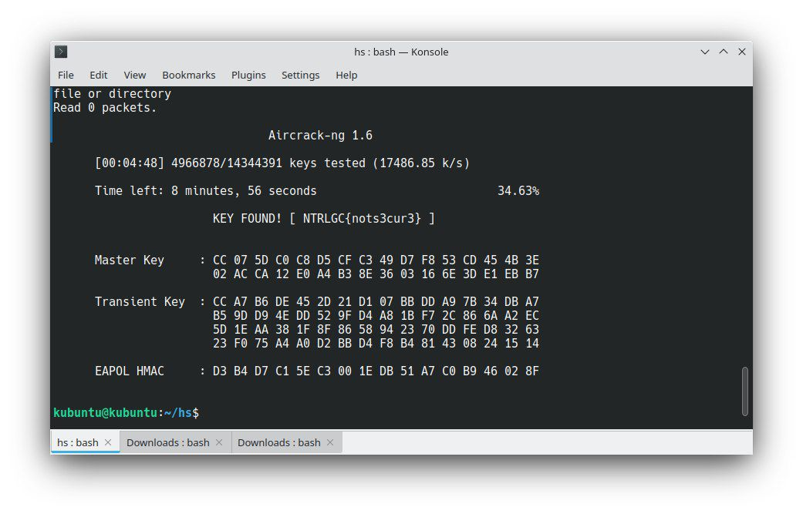

## Wi-Fi

This is obviously a wi-fi handshake capture file.
We can try cracking it with `aircrack-ng` using the `rockyou` wordlist.
We know that the flag follows the `NTRLGC{.*}` pattern, so a fair thing to do is to mutate the wordlist to make it use this format.
There are infinite ways to do it, but here are two:

- with `python`
```python
with open('rockyou.txt','r', errors='ignore') as rf:
    with open('newrock.txt','w') as nf:
        while True:
            line = rf.readline()
            if not line:
                break
            line = line.strip()
            nf.write("NTRLGC{"+line+"}\n")
```

- with `sed`
```shell
sed 's/^/NTRLGC{/' newrock.txt | sed 's/$/}/' > ntrlgc.txt
```

Now we can start cracking:

```shell
aircrack-ng -w newrock.txt ShipyardWiFi.cap
```

There it goes:

